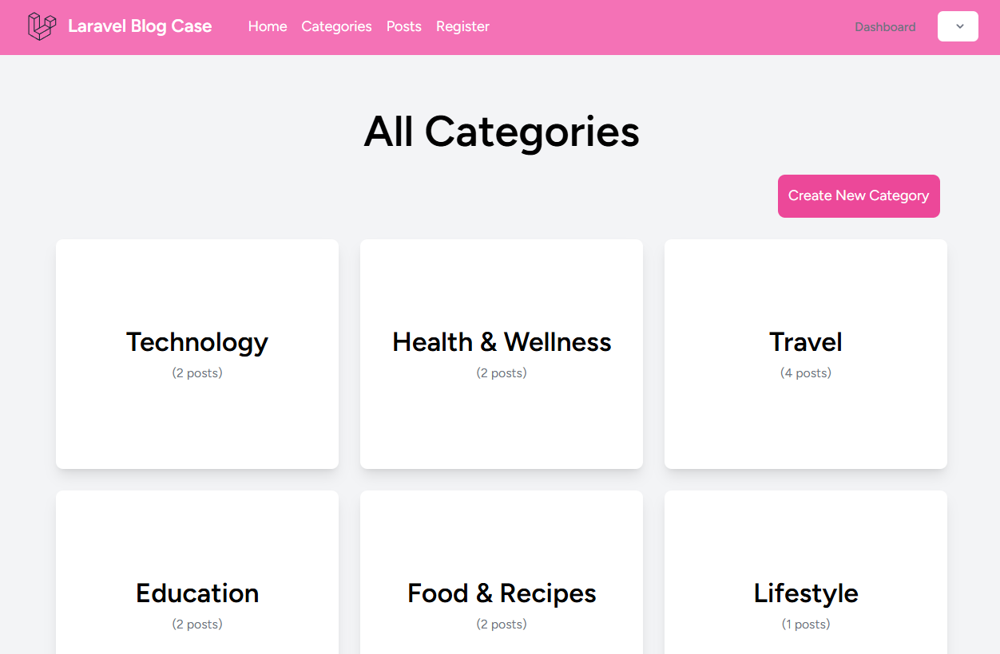

# Laravel Blog Case

This is a simple blog application built using Laravel. Users can create, view, edit, and delete posts. Categories can also be created and assigned to posts. It provides a basic demonstration of how to set up a blog with user authentication and role-based access control.

## Features
- User authentication (login, registration).
- CRUD operations for posts.
- Category management.
- Responsive and user-friendly design.

## Requirements
- PHP >= 8.0
- Composer
- MySQL or any relational database
- Node.js (for frontend assets compilation)

## Installation

1. Clone the repository:

   ```bash
   git clone https://github.com/salihakotan/laravel-blog-case.git
   cd laravel-blog-case
   ```

2. Install the dependencies:

   ```bash
   composer install
   ```

3. Copy `.env.example` to `.env`:

   ```bash
   cp .env.example .env
   ```

4. Generate the application key:

   ```bash
   php artisan key:generate
   ```

5. Set up the database in `.env` file:
   Update the following database settings in the `.env` file:

   ```
   DB_CONNECTION=mysql
   DB_HOST=127.0.0.1
   DB_PORT=3306
   DB_DATABASE=your_database_name
   DB_USERNAME=your_database_username
   DB_PASSWORD=your_database_password
   ```

6. Run migrations to set up the database schema:

   ```bash
   php artisan migrate
   ```

7. Install frontend dependencies and compile assets:

   ```bash
   npm install
   npm run dev
   ```

8. Serve the application:

   ```bash
   php artisan serve
   ```

   The application will be available at `http://localhost:8000`.

## Usage

- To create a new post, go to the "Posts" section in the navigation menu.
- To add categories, go to the "Categories" section and create new categories.
- The application provides a simple interface to manage posts and categories.

## Contributing

If you'd like to contribute to the project, feel free to fork the repository, make changes, and submit a pull request. Make sure to follow the code style and run the tests before submitting.

## License

This project is licensed under the MIT License - see the [LICENSE](LICENSE) file for details.

## Authors

- **Salih Akotan** - [GitHub](https://github.com/salihakotan)

## Acknowledgements

- Laravel Framework
- Breeze for authentication scaffolding
- Tailwind CSS for styling
- Font Awesome for icons
